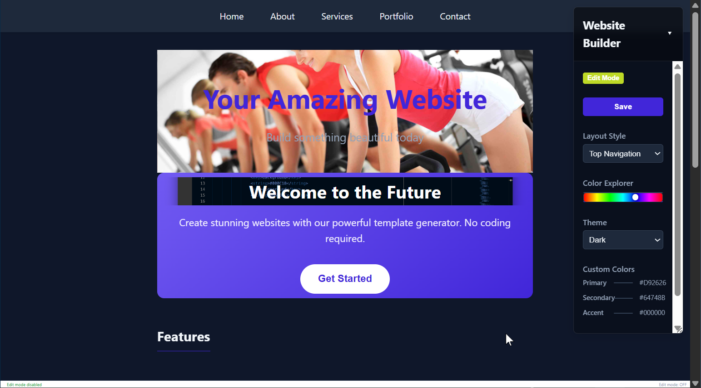

# Introducing the Claude AI Website Builder

## Build Professional Websites Without Writing Code

The Claude AI Website Builder transforms how websites are created. This browser-based tool puts professional web design within reach of everyone - no coding experience required.

## What Makes It Different

Unlike traditional website builders that lock you into templates, this tool gives you direct control over every element while maintaining simplicity. Edit text inline, adjust colors with visual sliders, swap layouts instantly, and add images with a click. Your changes happen in real-time, right in your browser.

## Key Capabilities

### Visual Design Control

- **Live editing mode** - click any text to modify it directly
- **Color Explorer** with fine-tuning controls for perfect brand colors
- **Multiple pre-built themes** (Dark, Light, Cyberpunk, Ocean, Sunset, Forest)
- **Instant layout switching** between navigation styles

### Smart Content Management

- **Dynamic page generation** - navigation links automatically create new pages
- **Media placeholders** that transform into image containers
- **Scroll-to-resize images** for perfect sizing
- **Persistent state management** - your work saves automatically

### Professional Output

- **Responsive design** that looks perfect on all devices
- **Modern glassmorphism effects** and smooth animations
- **Clean, semantic HTML structure**
- **Optimized performance** with pure CSS/JavaScript

## Who It's For

- **Small business owners** who need a professional web presence quickly
- **Creatives** who want to focus on design, not code
- **Entrepreneurs** launching new ventures
- **Anyone** who's been frustrated by the limitations of traditional site builders

## The Technical Edge

Built with **TypeScript** for reliability and pure **vanilla JavaScript** for performance, the Website Builder requires no external dependencies or frameworks. It runs entirely in your browser, keeping your work private and secure. The generated websites are clean, fast, and ready for deployment anywhere.

## Coming Soon

Early access opens soon. The first release will include all core features shown here, with regular updates adding new themes, templates, and export options based on user feedback.

---

**The Claude AI Website Builder: Where design meets simplicity.**
