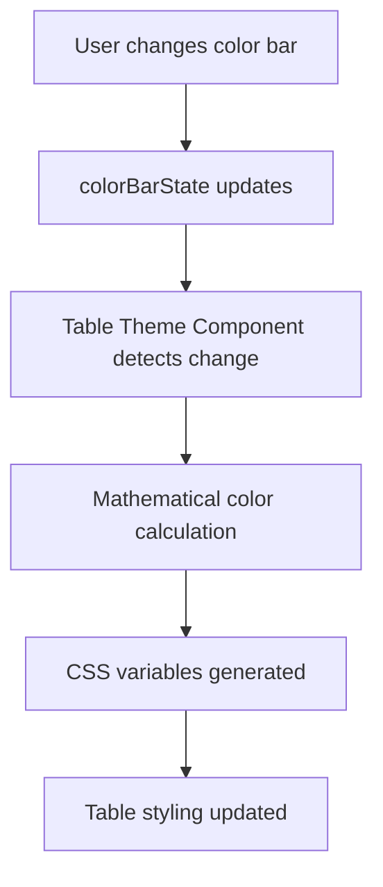

# Table Theme Component

A mathematical web component that automatically generates table themes by inheriting from the Claude AI Website Builder's color system. Uses golden ratio formulas and color theory to create harmonious table styling without code duplication.

## Overview

The Table Theme Component is a zero-configuration web component that:
- **Inherits** from your existing `wb.css` variables and formulas
- **Listens** to color bar changes, theme switches, and dark mode toggles
- **Generates** mathematically harmonious table colors using HSL calculations
- **Updates** automatically in real-time as users modify colors
- **Uses** golden ratio spacing and transitions from your design system

## Quick Start

### 1. Include the Component

Add the component script to your HTML:

```html
<script type="module" src="table-theme-component.js"></script>
```

### 2. Add Table Components

The theme component automatically detects and styles any `table-component` elements:

```html
<table-component sortable paginated striped>
  <!-- Your table content -->
</table-component>
```

### 3. That's It!

The component automatically:
- Creates itself when table components are detected
- Listens to your existing color system changes
- Generates and applies mathematical themes
- Updates in real-time with color/theme changes

## Features

### 🎨 **Automatic Color Inheritance**
- Reads HSL values from your existing `colorBarState`
- Listens to color bar, lightness, and saturation sliders
- Responds to theme changes (light, dark, cyberpunk, ocean, etc.)
- Detects dark mode switches automatically

### 📐 **Mathematical Precision**
- Uses golden ratio formulas from `wb.css`
- Applies color theory for harmonious palettes
- Calculates optimal contrast ratios
- Generates complementary and analogous colors

### 🔄 **Real-time Updates**
- No page refresh needed
- Instant theme application
- Smooth transitions using existing CSS variables
- Performance optimized with change detection

### 📱 **Responsive Design**
- Inherits responsive breakpoints from `wb.css`
- Uses existing spacing scale for mobile optimization
- Maintains accessibility across devices

## How It Works

### Color Inheritance Flow



### Mathematical Formulas

The component uses these calculations:

```javascript
// Primary color from your color bar
const primaryHex = hslToHex(hue, saturation, lightness);

// Light variation (80% saturation, 130% lightness)
const primaryLight = hslToHex(hue, saturation * 0.8, lightness * 1.3);

// Dark variation (110% saturation, 70% lightness)  
const primaryDark = hslToHex(hue, saturation * 1.1, lightness * 0.7);

// Background colors using mathematical relationships
const bgSecondary = isDarkMode ?
  hslToHex(hue, saturation * 0.4, 12) :  // Dark mode: 40% sat, 12% light
  hslToHex(hue, saturation * 0.2, 95);   // Light mode: 20% sat, 95% light
```

### CSS Variable Inheritance

```css
/* Inherits from wb.css instead of duplicating */
--table-cell-padding: var(--space-sm) var(--space-md);
--table-border-radius: calc(var(--space-xs) * var(--golden-ratio));
--table-transition: var(--transition-fast);
--table-shadow: 0 calc(var(--space-xs) / 2) var(--space-md) var(--glass-shadow);
```

## Integration with Website Builder

### Listens to These Events:
- Color bar input changes (`#color-bar`)
- Lightness slider changes (`#lightness-slider`) 
- Saturation slider changes (`#saturation-slider`)
- Theme attribute changes (`data-theme`)
- Color mode changes (`data-color-mode`)

### Reads from These Sources:
- Global `colorBarState` object from `wb.js`
- CSS custom properties from `wb.css`
- Body attributes for theme and mode
- Existing color picker values

## Supported Table Features

The component automatically styles these table features:

### Table Attributes
```html
<table-component 
  sortable          <!-- Sortable column headers -->
  paginated         <!-- Pagination controls -->
  selectable        <!-- Row selection checkboxes -->
  striped           <!-- Alternating row colors -->
  bordered          <!-- Cell borders -->
  compact           <!-- Reduced padding -->
  loading           <!-- Loading state -->
>
</table-component>
```

### Generated Styles
- **Headers**: Gradient backgrounds with mathematical contrast
- **Rows**: Hover effects with golden ratio transforms
- **Selection**: Highlighted rows with accent borders
- **Pagination**: Themed buttons with smooth transitions
- **Sorting**: Color-coded sort indicators
- **Status badges**: Adaptive colors based on theme

## Customization

### Theme Override
While the component automatically inherits themes, you can dispatch custom events:

```javascript
// Manually trigger theme update
document.dispatchEvent(new CustomEvent('table-theme-update', {
  detail: { hue: 240, saturation: 70, lightness: 50, isDarkMode: false }
}));
```

### Custom CSS Variables
You can override specific table variables:

```css
table-component {
  --table-cell-padding: var(--space-lg) var(--space-xl);
  --table-border-radius: var(--space-md);
}
```

### Event Listening
Listen for theme updates:

```javascript
document.addEventListener('table-theme-updated', (event) => {
  console.log('Table theme updated:', event.detail);
  // { theme, hsl, isDarkMode, currentTheme }
});
```

## Browser Support

- **Modern Browsers**: Chrome 54+, Firefox 63+, Safari 10.1+, Edge 79+
- **Web Components**: Requires native support or polyfill
- **CSS Variables**: Full support in target browsers
- **ES6 Modules**: Required for module imports

## Performance

### Optimizations
- **Change Detection**: Only recalculates when values actually change
- **Cached Values**: Stores last known state to prevent unnecessary updates
- **CSS Variables**: Uses native CSS for styling (no JavaScript during renders)
- **Efficient Polling**: 100ms interval with early exit if no changes

### Memory Usage
- **Lightweight**: ~2KB minified and gzipped
- **No Dependencies**: Pure vanilla JavaScript
- **Automatic Cleanup**: Removes event listeners on disconnect

## Troubleshooting

### Component Not Loading
```javascript
// Check if component is registered
if (!customElements.get('table-theme-component')) {
  console.error('Table theme component not loaded');
}

// Check if colorBarState exists
if (typeof colorBarState === 'undefined') {
  console.error('colorBarState not found - ensure wb.js is loaded first');
}
```

### Styles Not Applying
```javascript
// Check if style element exists
const styleEl = document.getElementById('table-theme-inherited');
if (!styleEl) {
  console.error('Table theme styles not generated');
}

// Verify CSS variables
const rootStyles = getComputedStyle(document.documentElement);
console.log('Primary color:', rootStyles.getPropertyValue('--primary'));
```

### Theme Not Updating
```javascript
// Force theme regeneration
const themeComponent = document.querySelector('table-theme-component');
if (themeComponent) {
  themeComponent.generateTableTheme();
}
```

## Development

### File Structure
```
table-theme-component.js    # Main component file
wb.css                     # Base design system (required)
wb.js                      # Color system (required)
table-component.js         # Table component (required)
```

### Dependencies
- **Required**: `wb.css` (design system variables)
- **Required**: `wb.js` (colorBarState and utility functions)
- **Required**: `table-component.js` (table web component)
- **Optional**: Any additional table-related components

### Integration Order
1. Load `wb.css` (design system)
2. Load `wb.js` (color system)
3. Load `table-component.js` (table functionality)
4. Load `table-theme-component.js` (theme inheritance)

## Examples

### Basic Usage
```html
<!DOCTYPE html>
<html>
<head>
  <link rel="stylesheet" href="wb.css">
</head>
<body>
  <table-component sortable paginated>
    <!-- Table content -->
  </table-component>
  
  <script src="wb.js"></script>
  <script type="module" src="table-component.js"></script>
  <script type="module" src="table-theme-component.js"></script>
</body>
</html>
```

### With Custom Colors
```javascript
// Set custom color in existing color bar system
colorBarState.hue = 180;        // Cyan
colorBarState.saturation = 80;  // Vibrant
colorBarState.lightness = 45;   // Medium

// Theme component automatically updates tables
```

### Multiple Tables
```html
<!-- All tables automatically inherit the same theme -->
<table-component id="users-table" sortable striped>
  <!-- User data -->
</table-component>

<table-component id="products-table" paginated bordered>
  <!-- Product data -->
</table-component>

<table-component id="orders-table" selectable compact>
  <!-- Order data -->
</table-component>
```

## License

This component is part of the Claude AI Website Builder project. See the main project license for details.

## Contributing

1. Ensure changes maintain compatibility with `wb.css` variables
2. Test with all existing themes (light, dark, cyberpunk, ocean, sunset, forest)
3. Verify mathematical relationships remain harmonious
4. Test real-time updates with color bar changes
5. Maintain zero-duplication principle with existing design system

## Changelog

### Version 1.0.0
- Initial release with full wb.css integration
- Mathematical color generation using HSL formulas
- Real-time theme inheritance and updates
- Golden ratio spacing and transition inheritance
- Support for all existing table component features